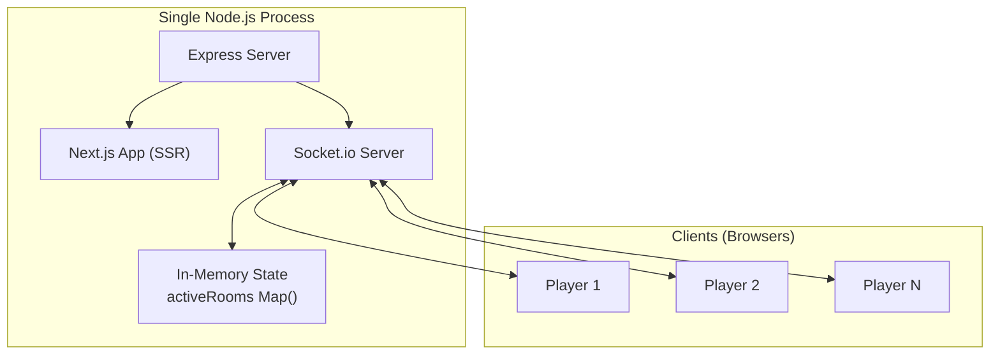

# Poker Engine & Digital Ledger — Implementation Plan

A real-time, turn-based Texas Hold'em chip/betting manager for in-person play. The app manages chips, betting math, turn enforcement, pot distribution, and house rules — **no card tracking**.

---

## Architecture Overview



**Custom Server Pattern**: A single `server.js` runs Express + Socket.io + Next.js. HTTP handles page loads only; all game actions flow through WebSocket events.

---

## User Review Required

> [!IMPORTANT]
> **No External Database**: All state lives in-memory via a `Map()`. Server restart = all data lost. This is by design per your spec.

> [!IMPORTANT]
> **Custom Server**: Using a custom Node.js server means this cannot deploy to Vercel. It needs a persistent server (Railway, Render, DigitalOcean, etc.). For dev, we run via `node server.js`.

> [!WARNING]
> **Tailwind CSS Version**: The plan uses **Tailwind CSS v3** (bundled via `create-next-app`). Please confirm if you want v4 instead.

---

## Project Structure

```
d:\Poker\
├── server.js                    # Custom Express + Socket.io + Next.js server
├── server/
│   ├── gameEngine.js            # Pure game logic (state mutations, validations)
│   ├── socketHandlers.js        # Socket.io event handlers (wiring)
│   └── roomManager.js           # activeRooms Map, room lifecycle, cleanup
├── src/
│   ├── app/
│   │   ├── layout.js            # Root layout (fonts, metadata)
│   │   ├── page.js              # Landing page (Create/Join)
│   │   ├── globals.css          # Tailwind + custom styles
│   │   ├── lobby/
│   │   │   └── page.js          # Lobby screen (reorder players, settings, buy-in)
│   │   ├── game/
│   │   │   └── page.js          # Main game table
│   │   └── stats/
│   │       └── page.js          # End-of-game statistics
│   ├── components/
│   │   ├── PlayerCard.js        # Player chip display card
│   │   ├── ActionPanel.js       # Betting action buttons (Check/Call/Raise/Fold/Done)
│   │   ├── PotDisplay.js        # Central pot display with animations
│   │   ├── AdminControls.js     # Undo Round, Conclude, override panel
│   │   ├── SettingsPanel.js     # Blind mode, sequence mode config
│   │   ├── BuyInSelector.js     # Stack selection UI
│   │   ├── ShowdownPanel.js     # I WON / I LOST voting
│   │   ├── RebuyModal.js        # Add chips modal
│   │   ├── PlayerList.js        # Draggable lobby player list
│   │   └── RoundIndicator.js    # Pre-flop → Flop → Turn → River tracker
│   ├── context/
│   │   └── SocketContext.js     # React context for socket instance + room state
│   └── lib/
│       └── socket.js            # Socket.io client singleton
├── public/
│   └── favicon.ico
├── package.json
├── next.config.js
├── tailwind.config.js
└── jsconfig.json
```

---

## Proposed Changes

### Phase 1: Project Scaffolding

#### [NEW] Project initialization
- Run `npx -y create-next-app@latest ./ --javascript --tailwind --eslint --app --src-dir --use-npm`
- Install additional deps: `socket.io`, `socket.io-client`, `express`, `uuid`

#### [NEW] [server.js](file:///d:/Poker/server.js)
Custom server entry point:
- Creates Express app + HTTP server
- Initializes Socket.io with CORS config
- Calls `next({ dev })` and `app.prepare()`
- Mounts socket handlers from `server/socketHandlers.js`
- Falls through to Next.js request handler for all HTTP
- Listens on `process.env.PORT || 3000`

#### [MODIFY] [package.json](file:///d:/Poker/package.json)
- Change `"dev"` script to `"node server.js"`
- Change `"start"` to `"NODE_ENV=production node server.js"`
- Keep `"build"` as `"next build"`

---

### Phase 2: Server-Side Game Engine

#### [NEW] [roomManager.js](file:///d:/Poker/server/roomManager.js)
- `activeRooms = new Map()`
- `createRoom(adminId, adminName)` → generates 4-digit code, returns room object
- `joinRoom(roomId, playerId, playerName)` → adds player to room
- `getRoom(roomId)` → returns room state
- `deleteRoom(roomId)` → removes from Map
- `trackConnection(socketId, roomId)` → maps socket IDs to rooms for disconnect cleanup

#### [NEW] [gameEngine.js](file:///d:/Poker/server/gameEngine.js)
Pure functions that mutate room state. Core functions:

| Function | Description |
|---|---|
| `startHand(room)` | Collects blinds/antes, sets `currentRound: "pre-flop"`, takes initial snapshot |
| `handleAction(room, playerId, action, amount)` | Processes Check/Call/Raise/Fold, updates contributions, advances turn |
| `advanceTurn(room)` | Moves `activePlayerIndex` to next non-folded player |
| `isRoundComplete(room)` | Returns true when all active players match `currentRoundHighestBet` AND everyone has acted |
| `advanceRound(room)` | Moves to next street (flop→turn→river→showdown), resets `currentRoundContribution`, takes snapshot |
| `takeSnapshot(room)` | Deep copies current state into `roundHistory` |
| `undoRound(room)` | Pops last snapshot from `roundHistory` and replaces current state |
| `handleShowdownVote(room, playerId, vote)` | Records WON/LOST, evaluates consensus |
| `resolveShowdown(room, winners)` | Distributes pot, updates stacks |
| `concludeGame(room)` | Refunds pot proportionally via `totalHandContribution`, calculates stats |
| `rebuy(room, playerId, amount)` | Adds chips to player stack |
| `calculateStats(room)` | Computes P/L and biggest pot from completed hands |

#### [NEW] [socketHandlers.js](file:///d:/Poker/server/socketHandlers.js)
Wires Socket.io events to game engine functions:

| Event (Client → Server) | Handler |
|---|---|
| `room:create` | Creates room, joins socket to room, emits `room:created` |
| `room:join` | Validates code, adds player, emits `room:updated` to room |
| `room:reorder` | Admin-only: reorders `players` array |
| `room:settings` | Admin-only: updates settings object |
| `player:buyIn` | Locks player buy-in amount |
| `game:start` | Admin-only: validates all bought in, calls `startHand()` |
| `game:action` | Validates it's player's turn, calls `handleAction()` |
| `game:rebuy` | Calls `rebuy()`, broadcasts update |
| `game:showdownVote` | Records vote, checks consensus |
| `game:undoWinner` | Admin-only: reverses winner, resets to vote |
| `game:undoRound` | Admin-only: restores snapshot |
| `game:nextHand` | Starts new hand |
| `game:conclude` | Refunds pot, calculates stats, transitions to stats screen |
| `disconnect` | Removes socket from room tracking, if room empty → delete |

---

### Phase 3: Frontend Foundation

#### [MODIFY] [globals.css](file:///d:/Poker/src/app/globals.css)
- Dark theme with deep green/black poker-table aesthetic
- Custom CSS variables for accent colors (gold, emerald, crimson)
- Card-like glassmorphism panels
- Smooth transition/animation keyframes (chip slide, pot pulse, turn glow)
- Custom scrollbar styling

#### [MODIFY] [layout.js](file:///d:/Poker/src/app/layout.js)
- Import Google Font (Outfit + JetBrains Mono for numbers)
- Wrap children in `SocketProvider`
- SEO meta tags

#### [NEW] [socket.js](file:///d:/Poker/src/lib/socket.js)
- Singleton Socket.io client: `io()` connecting to same origin
- Auto-reconnect configuration

#### [NEW] [SocketContext.js](file:///d:/Poker/src/context/SocketContext.js)
- React Context providing: `socket`, `roomState`, `playerId`, `isAdmin`
- Listens for `room:updated` and `game:stateUpdate` events
- Stores `playerId` in sessionStorage for reconnection

---

### Phase 4: Screens & Pages

#### [NEW] [page.js](file:///d:/Poker/src/app/page.js) — Landing
- Hero section with app title and poker-chip animated logo
- Two CTA cards: **Create Room** (generates code) and **Join Room** (input code + name)
- Animated background (subtle card suit patterns)
- On success → redirect to `/lobby?room=XXXX`

#### [NEW] [lobby/page.js](file:///d:/Poker/src/app/lobby/page.js) — Lobby
- Room code display (large, copyable)
- Horizontal scrollable player list with drag-to-reorder (Admin only, using native HTML5 drag API)
- Settings panel (Admin only): Blind Mode toggle, Sequence Mode toggle
- Buy-in selector for each player (5000 / 10000 / 20000 / Custom)
- "Lock In" button per player, "Start Game" for admin (disabled until all locked)
- Player join/leave real-time updates

#### [NEW] [game/page.js](file:///d:/Poker/src/app/game/page.js) — Game Table
- **Top bar**: Hand #, Round indicator (Pre-flop → Flop → Turn → River with progress dots)
- **Center**: Animated pot display with chip count
- **Player ring**: Circular/horizontal layout of all players showing name, stack, contribution, status (active/folded/current turn glow)
- **Bottom panel**: Action buttons contextual to game state:
  - Active turn: Check/Bet/Fold OR Call[Amount]/Raise/Fold + amount slider + "Done" confirmation
  - Not your turn: Disabled buttons, "Waiting for [Player]..." message
  - Showdown: I WON / I LOST buttons
- **Persistent**: Rebuy button (top-right), Admin controls drawer
- **Admin overlay**: Undo Round button, Conclude button, tie-override panel

#### [NEW] [stats/page.js](file:///d:/Poker/src/app/stats/page.js) — Statistics
- Player leaderboard sorted by profit
- Per-player: starting stack, final stack, net P/L with color coding (green/red)
- Biggest pot from completed hands
- "Back to Lobby" or "New Game" button

---

### Phase 5: Components

#### [NEW] [PlayerCard.js](file:///d:/Poker/src/components/PlayerCard.js)
- Displays name, chip stack (animated count), current contribution
- Visual states: active (green border), folded (dimmed), current turn (pulsing gold glow), dealer chip
- Compact layout for mobile

#### [NEW] [ActionPanel.js](file:///d:/Poker/src/components/ActionPanel.js)
- Dynamically renders buttons based on `AmountToCall` calculation
- Amount slider for Bet/Raise with preset buttons (Min, 1/2 Pot, Pot, All-In)
- "Done" confirmation step before emitting action
- Disabled state when not player's turn

#### [NEW] [PotDisplay.js](file:///d:/Poker/src/components/PotDisplay.js)
- Large center pot number with chip icon
- Pulse animation on pot increase
- Side pots display if applicable

#### [NEW] [AdminControls.js](file:///d:/Poker/src/components/AdminControls.js)
- Slide-out drawer with: Undo Round, Conclude Game
- Tie override panel (appears after showdown tie): Undo Winner, Next Game, Conclude
- Confirmation modals for destructive actions

#### [NEW] [SettingsPanel.js](file:///d:/Poker/src/components/SettingsPanel.js)
- Toggle switch for Blind Mode (Standard vs Ante)
- Toggle switch for Sequence Mode (Standard vs Winner's Curse)
- Blind amount inputs (SB/BB or Ante amount)

#### [NEW] [BuyInSelector.js](file:///d:/Poker/src/components/BuyInSelector.js)
- Preset chips: 5000, 10000, 20000
- Custom amount input
- "Lock In" button with confirmation animation

#### [NEW] [ShowdownPanel.js](file:///d:/Poker/src/components/ShowdownPanel.js)
- Large I WON / I LOST buttons
- Waiting screen for folded players
- Vote status indicators (who has voted)
- All-LOST detection → re-vote prompt

#### [NEW] [RebuyModal.js](file:///d:/Poker/src/components/RebuyModal.js)
- Modal overlay with custom amount input
- Quick-add presets
- Confirm button

#### [NEW] [PlayerList.js](file:///d:/Poker/src/components/PlayerList.js)
- Horizontal card list of joined players
- HTML5 drag-and-drop for reordering (Admin only)
- Player status indicators (bought in / waiting)

#### [NEW] [RoundIndicator.js](file:///d:/Poker/src/components/RoundIndicator.js)
- Horizontal progress bar: Pre-flop → Flop → Turn → River
- Active step highlighted with animation

---

### Phase 6: Game Logic Edge Cases

| Scenario | Handling |
|---|---|
| All players fold except one | Remaining player auto-wins pot, skip showdown |
| All-in player | Player marked all-in, skipped in turn rotation, still in showdown |
| Tie at showdown | Pot divided evenly among winners, admin override panel shown |
| All vote LOST | Reset showdown UI, prompt re-vote |
| Conclude mid-hand | Refund pot based on `totalHandContribution` per player |
| Undo at round start | Restore previous round's snapshot |
| Room empty on disconnect | Delete room from `activeRooms` Map |
| Player disconnects mid-game | Keep player in game state; if they reconnect with same ID, restore position |

---

### Phase 7: Polish & UX

- **Animations**: Chip count transitions (CSS `counter` or JS animation), pot pulse, turn glow, button press haptics
- **Sound effects**: Optional subtle UI sounds (can be toggled)
- **Mobile-first**: Entire UI optimized for phone screens (primary use case for in-person play)
- **Toast notifications**: Player joined, action taken, pot won
- **Dark mode**: Primary theme — deep green felt + gold accents
- **Typography**: Outfit for UI text, JetBrains Mono for chip numbers

---

## Open Questions

> [!IMPORTANT]
> 1. **Blind Amounts**: Should the admin be able to set custom blind amounts (SB/BB values), or are these fixed? Same question for Ante amount.

> [!IMPORTANT]  
> 2. **Reconnection**: If a player's browser refreshes mid-game, should they be able to rejoin with the same name and resume their seat? (I'm planning to use sessionStorage for player ID persistence.)

> [!NOTE]
> 3. **Dealer Button**: Should the UI show a visual dealer button indicator that rotates each hand?

---

## Verification Plan

### Automated Tests
- Start dev server and verify Socket.io connection handshake
- Test full game flow in browser: Create → Join (2+ tabs) → Buy-in → Start → Bet round → Showdown → Stats

### Manual Verification
- Open 3-4 browser tabs simulating different players
- Verify turn enforcement (only active player can act)
- Test all action combos: Check → Bet → Call → Raise → Fold
- Test undo round at various points
- Test conclude mid-hand (verify refund math)
- Test room cleanup on all tabs closed
- Test mobile responsiveness
